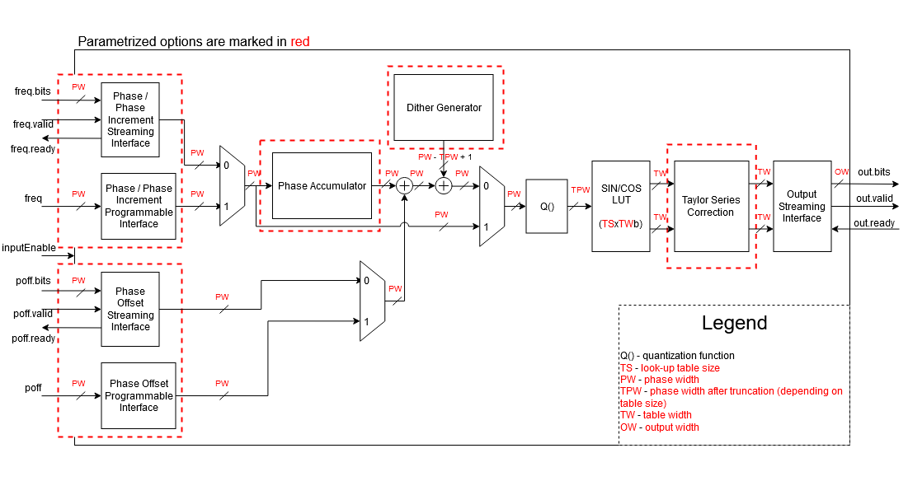

Numerically Controlled Oscillator (NCO) Chisel Generator
========================================================

## Overview
This repository contains a generator of a parametrizable numerically controlled oscillator with various options, written in [Chisel](http://www.chisel-lang.org) hardware design language. Numerically Controlled 
Oscillators (NCO), or Direct Digital Synthesizers (DDS), are important components in many digital communication systems. They are used for constructing digital down and up converters, demodulators, and implementing various types of modulation schemes.

To make a Chisel project and include NCO generator, an open source starter template [Chipyard Framework](http://github.com/ucb-bar/chipyard) can be used.

### Numerically controlled oscillators
A Numerically Controlled Oscillator sources sinusoidal waveforms for use in many applications.  A common method for digitally generating a complex valued sinusoid uses a lookup table scheme. A lookup 
table stores samples of a sinusoid. A digital integrator is used to generate an appropriate phase argument mapped by the lookup table to give the desired output waveform. Output waveform depends on the hardware parameters, as well as on the system clock signal frequency.

The NCO generator has following features:
	- SIN/COS Lookup table can be generated individually or together with Phase Generator
	- Standard or Rasterized mode where Rasterized mode eliminates phase noise from phase truncation
	- Lookup table can be stored in distributed or block RAM
	- Lookup table size, as well as the size of data samples inside the table can vary
	- Optional phase dithering that spreads the spectral line energy for greater Spurious Free Dynamic Ranage (SFDR)
	- Phase dithering or Taylor series correction options provide high dynamic range signals
	- Output data precision can vary
	- Different input interfaces
	- Optinal multiplier used for the output
	- Output buffering

The generated module consists of a Phase Generator and a SIN/COS Lookup Table (phase to sinusoid conversion). SIN/COS Lookup Table can also be used individually. The Phase Generator consists of a phase accumulator followed 
by an optional adder to provide addition of phase offset. The phase increment and phase offset can be independently configured to be either fixed, programmable or streaming (AXI4 interface). When configured as fixed, the 
NCO ouput frequency is set when the module is customized and cannot be adjusted after it is embedded in design. When configured as programmable, output frequency depends on the inputs. It is up to the user to regulate them. 
When configured as streaming, ouput frequency depends on the streaming inputs using AXI4 protocol. Output always has a streaming interface. When the phase generator is not used, phase increment input port becomes input port
for the absolute value of the phase used for transformation into sine and cosine outputs using look-up table. Look-up table can be implemented either using block RAM or distributed RAM. The latency of the module depends on the
type of the implemented memory and can be either one clock cycle if distributed RAM is used or two clock cycles if block RAM is used. Because of the symmetry of the sinusoid waveform, only a quarter cycle of the waveform is
stored in the memory, leading to considerable memory reduction. In standard mode of operation, characteristics of the output waveform, such as SFDR are degraded because of the phase truncation performed in order to get the address for the look-up table. 
There are two options regarding the improvement of waveform characteristics: phase dithering and interpolation using Taylor series correction. In the rasterized mode of operation, there is no phase truncation. Rasterized operation is 
intended for configurations where the desired frequency is a rational fraction of the system clock frequency. 
In the rasterized mode, output frequency equals *fout = (fclk x pinc) / M*, where *fclk* is system clock frequency, 
*pinc* is phase increment and *M* is the value four times larger than the look-up table size. 
In standard mode, output frequency is equal *fout = (fclk x pinc) / 2B*, where *B* is the phase width after truncation. Block diagram of a NCO generator is shown below.

Previously explained generator is described with following Scala files available inside`src/main/scala` directory:

 - `TreeReduce.scala` - contains modified `TreeReduce` function
 - `SyncROM.scala`- contains description of `SyncROM` - block RAM memory module
 - `NCOTable.scala` - contains look-up table parameter description and look-up table itself
 - `NCO.scala` - contains parameter description and top level module `NCO`
 
### Inputs 
[Decoupled](http://github.com/freechipsproject/chisel3/wiki/Interfaces-Bulk-Connections) interface is used if streaming interface is chosen. In that case, freq.bits are phase increment data or absolute phase value data and poff.bits are phase offset data.

- `freq`, phase increment or absolute phase value data: 
		- `Flipped(Decoupled(params.protoFreq))` - wrapped with valid/ready signals
		if appropriate interface is selected as streaming
		- `Input(params.protoFreq)` - if appropriate interface is selected as programmable
		- `None` - if appropriate interface is selected as fixed
- `poff`, phase offset: 
		- `Flipped(Decoupled(params.protoFreq))` - wrapped with valid/ready signals
		if appropriate interface is selected as streaming
		- `Input(params.protoFreq)` - if appropriate interface is selected as programmable
		- `None` - if appropriate interface is selected as fixed
- `inputEnable`, enable signal for fixed configuration:
		- `Input(Bool())` - used only if `freq` interface is selected as fixed
		
### Outputs
[Decoupled](http://github.com/freechipsproject/chisel3/wiki/Interfaces-Bulk-Connections) interface is used where .bits are data that should be sent to the streaming output.		
		
- `out: Decoupled(DspComplex(params.protoOut, params.protoOut))` - complex output data wrapped with valid/ready signals

### Setting up the parameters 

NCO parameters are defined inside `case class NCOParams`. User can set up these parameters in order to generate a numerically controlled oscillator for his own purposes.

	case class NCOParams[T <: Data]
	(
	  phaseWidth: Int,
	  tableSize: Int,
	  phaseConv: UInt => T,
	  protoFreq: UInt,
	  protoOut: T,
	  protoTable: Option[T] = None,
	  nInterpolationTerms: Int = 0,
	  rasterizedMode: Boolean,
	  ditherEnable: Boolean,
	  syncROMEnable: Boolean,
	  phaseAccEnable: Boolean,
	  roundingMode: TrimType = RoundHalfUp,
	  pincType: InterfaceType = Streaming,
	  poffType: InterfaceType = Streaming,
	  useMultiplier: Boolean = false
	)

The explanation of each parameter is given below:
- `phaseWidth` - width of the phase before phase truncation
- `tableSize` - size of the look-up table
- `phaseConv` - function that converts phase truncation surplus in order to use it in calculation of Taylor series terms
- `protoFreq` - data type of the frequency
- `protoOut` - data type of the output. Can be either FixedPoint or DspReal
- `protoTable` - data type of the samples inside look-up table. Can be either FixedPoint or DspReal
- `nInterpolationTerms` - number of terms to be calculated for Taylor series correction
- `rasterizedMode` - determines if the module will work in standard or rasterize mode of operation
- `ditherEnable` - determines if phase dithering will be used
- `syncROMEnable` - determines if look-up table will be implemented using block RAM or distributed RAM
- `phaseAccEnable` - determines if phase accumulator will be used
- `roundingMode` - rounding mode used for trimming values to fixed point
- `pincType` - type of the input interface for phase increment/absolute phase value
- `poffType` - type of the input interface for phase offset
- `useMultiplier` - determines if output multiplier will be used

## Tests

Besides main source code, various tests for NCO generator are provided in this repository. To run a test written in Scala simulation environment, user should execute the following command: `testOnly nco.testNameSpec` where 
`nco.testNameSpec` stands for a group of tests named testNameSpec inside nco package. These tests, as well as the other structures needed for running them, are located in `src/test/scala` directory in following files:
- `NCOTester.scala` - contains testers for testing both complete NCO module and values inside look-up table
- `NCOTableSpec.scala` - used for testing values inside look-up table. Can be run using `testOnly nco.NCOTableSpec` command
- `NCOSpec.scala` - used for testing complete NCO module. Can be run using `testOnly nco.NCOSpec` command
- `analysesTesterUtil.scala` - contains functions used for plotting frequency and time domains of signals
- `analysesTester` - contains tester used for parameter analysis of the NCO generator
- `analysesSpec` - used for analysing performance of generated NCO modules depending on several parameters. Can be run using `testOnly nco.NCOAnalysisSpec` command

Tester functions such as `peek`, `poke` and `expect`, available inside `DspTester` (check [dsptools Chisel library ](http://github.com/ucb-bar/dsptools)), are extensively used for design testing.

## NCOLazyModuleBlock

NCOLazyModuleBlock is a generator of numerically controlled oscillators with the same parameters and functionalities as the NCO generator described above, with one difference: it can use AXI4 Interface for accessing 
memory-mapped control registers. Whether this interface will be used or not depends on the parameters for input interfaces and multiplier. Following memory-mapped control registers can exist:
- `poff` - phase offset value when `poffType` parameter is set as Config
- `freq` - phase increment/phase value when `pincType` parameter is set as Config
- `inputEN` - input enable signal when `pincType` parameter is set as Fixed
- `enableMultiplying` - multiplying enable signal when `useMultiplier` parameter is set as true
- `multiplyingFactor` - factor value for multiplying when `useMultiplier` parameter is set as true. This value can be smaller or equal 1 and it is of the `protoOut` data type and format. It can be assigned by sending 
the binary representation in the appropriate format converted to integer value. For example, if FixedPoint data type with width equal to 16 and binary point equal to 14 is used, for setting the multiplying factor 
to 0.5, value of 0x2000 should be sent (binary representation of 0.5 in appropriate format is 00.10000000000000, converted to integer value it is 0010000000000000 binary or 0x2000 hex).

Also, input phase/phase increment and/or phase offset can have AXI4 Streaming Slave Interface if appropriate parameters are set as Streaming. Output signals always have AXI4 Streaming Master Interface.
